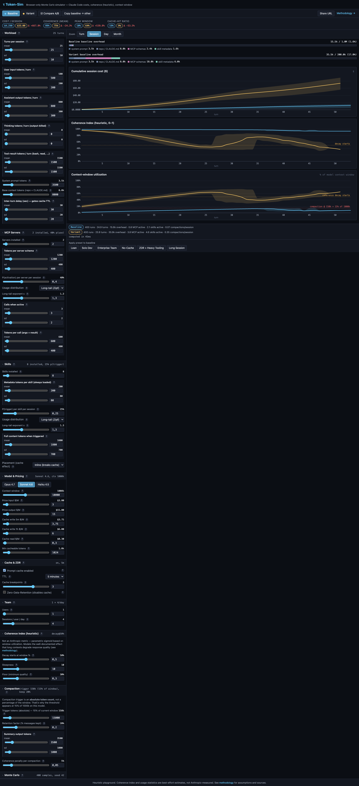

# τ token-sim

A browser-only, educational Monte Carlo simulator for **Claude Code token costs, session quality (heuristic), and context-window utilization**. Built as a blog-post companion: you tweak sliders, the charts update live, and the URL hash captures every parameter so you can share scenarios.

> **Live demo:** _coming soon (deploy via GitHub Pages — see below)_



## What it does

- Simulates a single Claude Code session, replicated across hundreds of Monte Carlo runs to produce **mean / p10 / p90** bands instead of point estimates.
- Lets you toggle between two configurations (Baseline vs. Variant) and shows the delta in cost, coherence, peak window utilization, and cache-hit ratio.
- Models the **window-impact of MCP servers and Skills**: how many are installed, how many actually activate per session, where their content sits relative to the cacheable prefix.
- Visualizes **context-rot** via a parametric Coherence Index (a heuristic, not an Anthropic metric).
- Documents every formula on a `/methodology` page with sources.

## Status

Heuristic. The math is a deliberately simple, transparent approximation of Claude Code's real behaviour — calibrated against Anthropic's public docs and one round of expert review, but not against measured production data. Numbers move with the model versions and pricing tables; defaults are accurate as of 2026-05.

**Found a math bug or a confusing UI element?** Open an issue using one of the templates:

- [Math model issue](../../issues/new?template=math-bug.yml)
- [UX feedback](../../issues/new?template=ux-feedback.yml)

Each template asks for a reproducible config URL — the simulator's hash-encoded state means you can share an exact scenario.

## Quickstart

```bash
npm install
npm run dev        # http://localhost:5178
```

```bash
npm run check      # svelte-check + tsc
npm run test       # vitest (engine math + URL codec)
npm run build      # static bundle in ./build
```

Requires Node 20+. No backend, no API keys, nothing leaves the browser.

## Deployment

The project is configured for static deployment via SvelteKit\'s `adapter-static`. Two ready-made paths:

### GitHub Pages (CI workflow included)

1. Push to the `main` branch of a public repo.
2. In **Settings → Pages**, set **Source** to "GitHub Actions".
3. The included workflow at `.github/workflows/deploy.yml` builds with `BASE_PATH=/<repo-name>` and `PUBLIC_REPO_URL=<your-repo-url>` and deploys.

That\'s it — the workflow handles the base-path quirk and writes a `.nojekyll` to bypass GitHub\'s default Jekyll processing.

### Vercel / Netlify / any static host

```bash
npm run build
# Upload ./build to your host of choice. SPA fallback to /index.html.
```

For a custom domain at the root path, omit `BASE_PATH`.

## How it works (one paragraph)

Each MC run draws session-level parameters (turn count, MCP activation, skill triggers) from configured distributions, then walks turn-by-turn through a session — accumulating context tokens, evaluating cache hits against the inter-turn delay vs. TTL, triggering compaction when context exceeds the model\'s `triggerPct × ctxWindow`, and computing per-turn cost. The Coherence Index is a parametric sigmoid centred at `decayStartPct` of the window, layered with cumulative compaction penalties. Everything runs in a Web Worker so the UI stays responsive while you drag sliders.

The math lives in `src/lib/engine/` and is fully covered by Vitest. The methodology page reproduces the formulas with the same notation as the code.

## Contributing

PRs welcome. Engine changes need a passing test; UI changes need a screenshot if the layout moves. Math defaults should cite a source.

- See [`CLAUDE.md`](./CLAUDE.md) for architecture orientation and common dev tasks.
- See [`docs/superpowers/specs/2026-05-18-token-sim-design.md`](./docs/superpowers/specs/2026-05-18-token-sim-design.md) for the original design spec.

## License

MIT.
